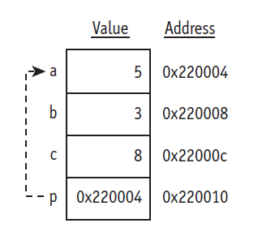

## LEC 3

Pointer
Roughly speaking, pointer is a variable which contains the address  information.

Ex.Pointer p points the variable a.



To declare a pointer use *    
```
int *p;
```

To point a variable use & (**address operator**)
p=&n;

```
int a=3;
int *p=&a;
```
To assign a value to the int pointed to by p
```
*p=5;
```
Here `*`(asterisk)  is  the **dereference operator** which can be read as "value pointed to by".

####Check 1. Declare a point p and point p to the variable a.
Assign 5 to a using pointer p and print the value of a using pointer p.
```
#include <iostream>
using namespace std;
int main ()
{
  int a=3;
  // declare a point p and point p to a.
  // assign 5 to a using pointer p.
  // print the value of a using pointer p.
  return 0;
}

```
<div id="rbutton-2-1-1" data-try="VM8SSho8-qgTEtyX" data-ans="VM8STzdyKNsSRNaq"></div>
